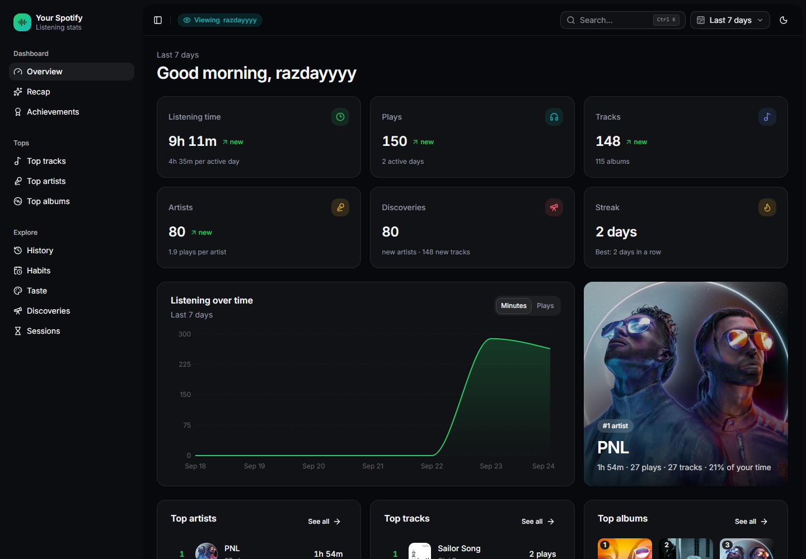
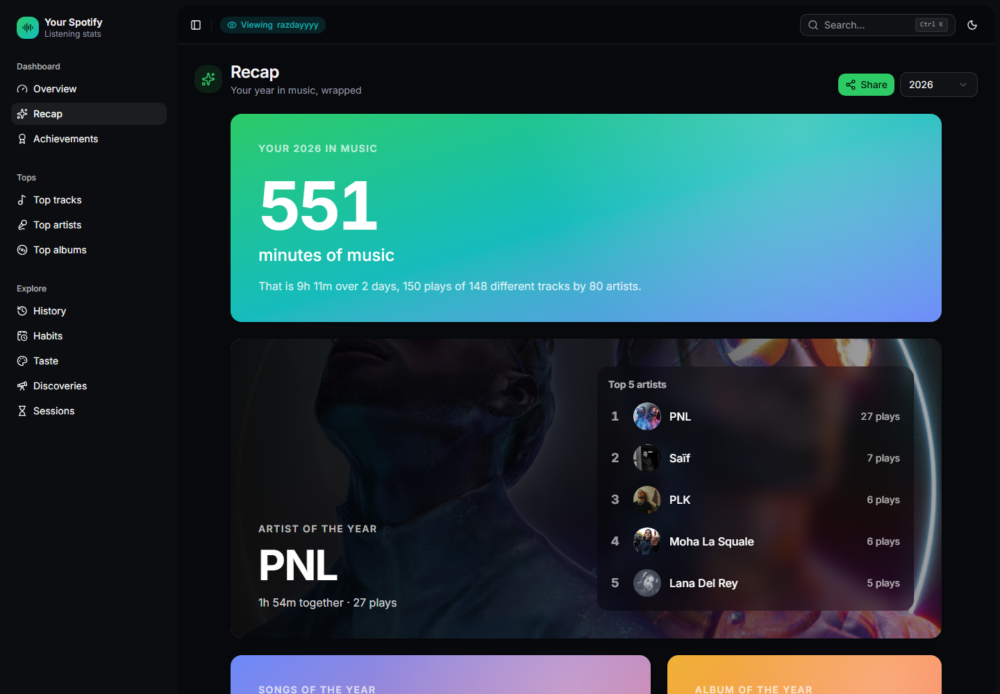
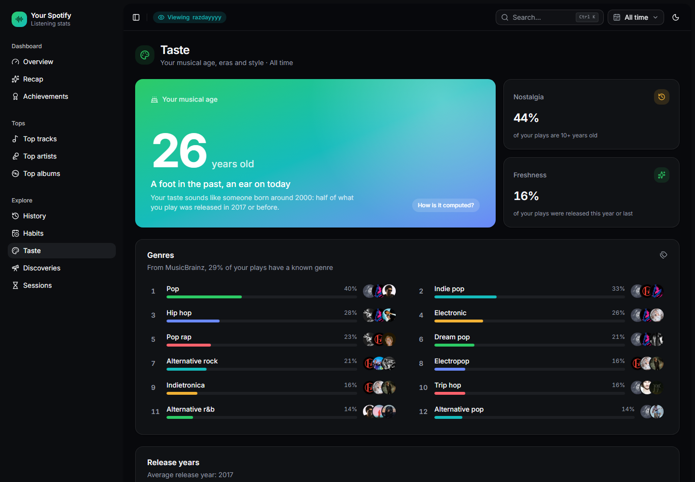
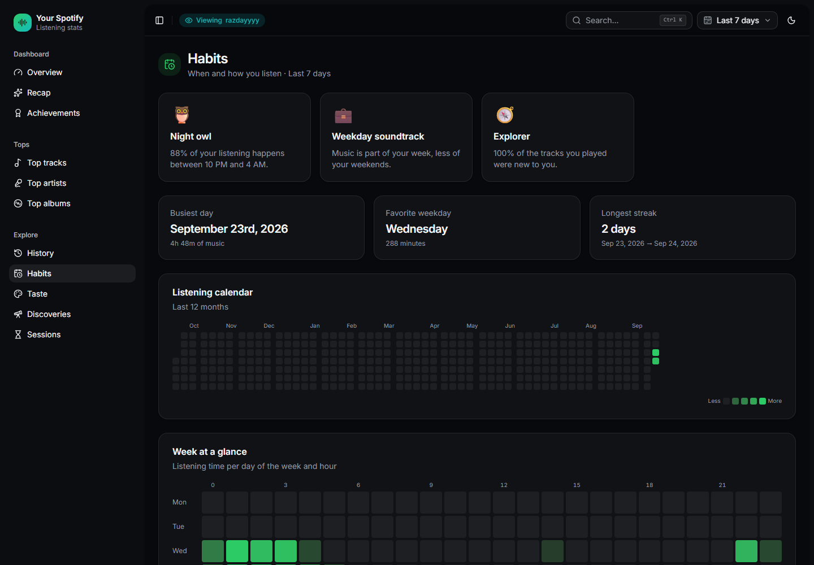
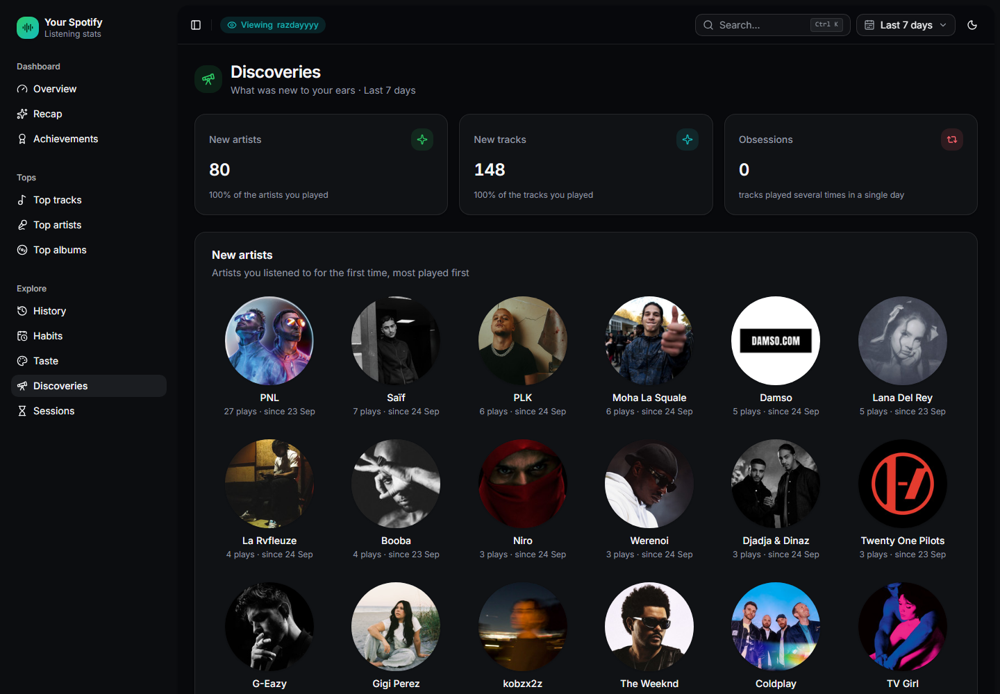
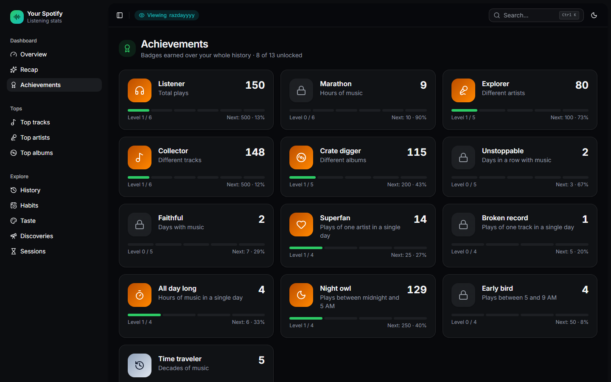
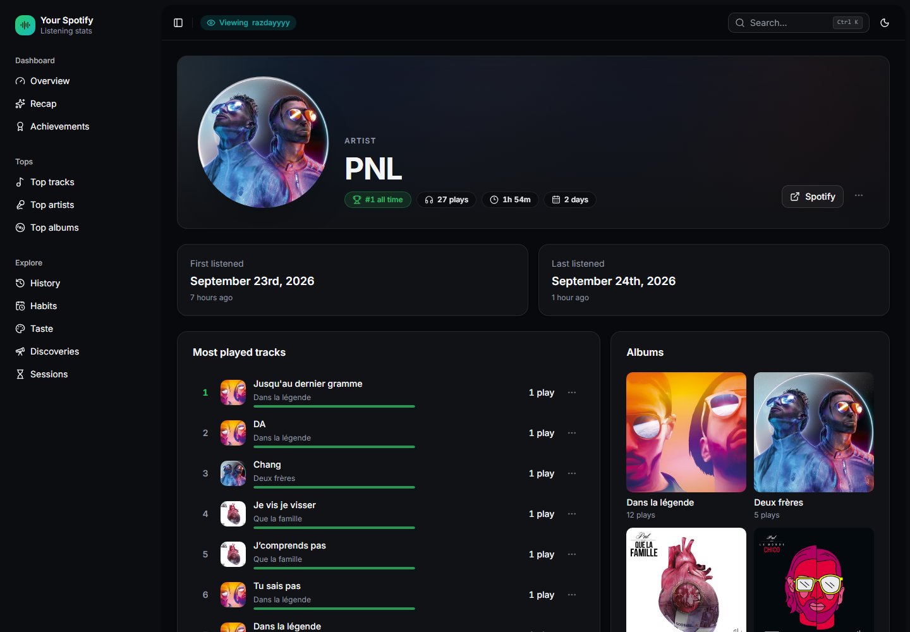
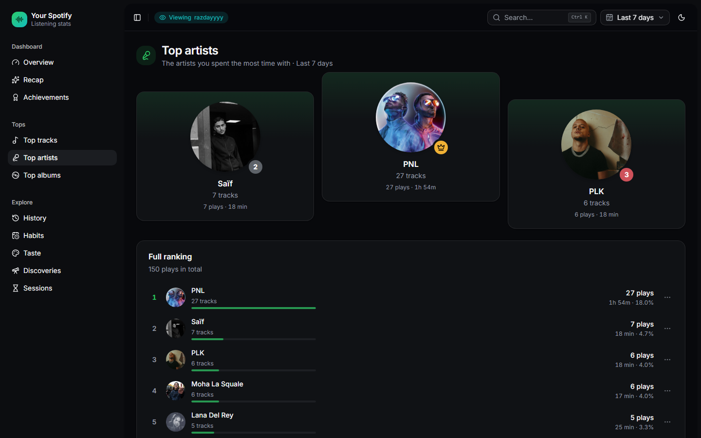
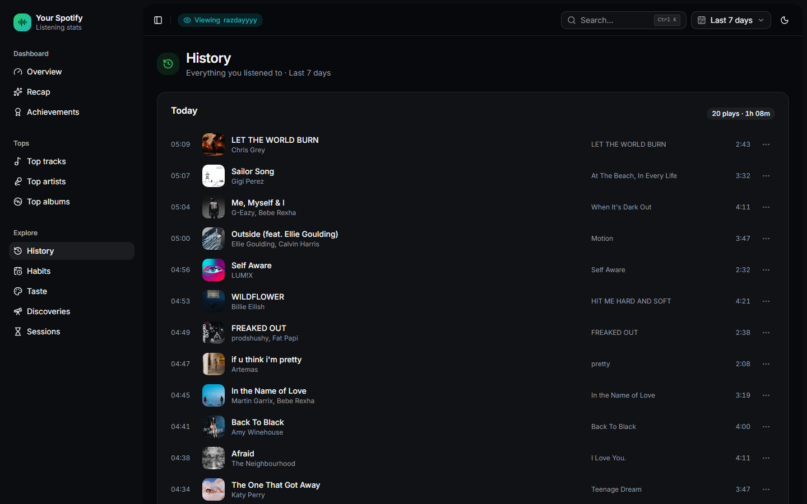

[](https://github.com/razday/your_spotify_v2/actions/workflows/docker.yml)

<p align='center'>
  <picture>
    <source media="(prefers-color-scheme: light)" srcset="docs/screenshots/overview-light.png">
    
  </picture>
</p>

# Your Spotify v2

**Your Spotify v2** is a self-hosted application that tracks what you listen to and gives you a dashboard to explore statistics about it.
It's made of a web server that polls the Spotify API every now and then, and a web application to explore your statistics.

This is a fork of [Yooooomi/your_spotify](https://github.com/Yooooomi/your_spotify) by Timothee Boussus, all the credit for the application goes to him.

## What's different from the original

- **A brand new interface** built with [shadcn/ui](https://ui.shadcn.com) and Tailwind: collapsible sidebar, Ctrl+K search, light/dark/system theme, period picker with custom ranges kept in the URL (every view can be shared), mobile friendly.
- **English and French**, English by default, chosen in **Settings > Preferences**.
- **Many new stats**:
  - Overview with KPIs compared to the previous period, listening trend and your #1 artist
  - **Recap**: a yearly "wrapped" of your top artists, songs, album, biggest day, streaks and more, that can be **shared as an image**
  - **Taste**: your estimated **musical age**, your **genres** (from [MusicBrainz](https://musicbrainz.org), since Spotify no longer gives them to new apps), the release years and decades you listen to (with the anthem of each year), nostalgia and freshness, formats, explicit content, track lengths
  - **Habits**: listening personality (night owl, weekend warrior, explorer...), GitHub like listening calendar, weekday x hour heatmap, streaks
  - **Discoveries**: new artists and tracks of the period, tracks played on repeat, **forgotten favorites** you have not played for a while (and a playlist to rediscover them)
  - **Achievements**: 13 badges with levels (listening time, artists, streaks, night owl...)
  - **Friends**: leaderboard of the users of your instance and your musical compatibility with each of them
  - Artist, album and track pages with monthly, hourly and weekday charts
- **Local accounts**: you log in with a username and a password. Logging in does not call Spotify anymore, so it doesn't use your Spotify app quota.
- **Several Spotify accounts per user**: link all your Spotify accounts, their history is merged in the same stats. Each account shows a link to its Spotify profile and when it was last synced, and can be **untracked** (kept for its history and its link, but no longer synced).
- **Spotify access expiry handled**: if Spotify revokes the access (password changed, access removed...), the app asks you to link the account again instead of silently stopping the sync.
- **Spotify player in the header**: see what is playing on each of your Spotify accounts, control it (play / pause, next, previous, seek, volume, shuffle, repeat), switch device, see the queue and add tracks to it. When several accounts play at the same time, a switcher shows them all. **Play on Spotify** goes to the account playing right now, on its active device. Controls need Spotify Premium.
- **Better playlists**: add a track to several playlists at once, see which playlists already have it, and a track is never added twice.
- **Spotify application set from the interface**: an admin can set or change the client ID and secret in **Settings > Admin**, no need to edit the environment and restart.
- **No more login loops**: when Spotify refuses an account (not added to a development mode app) or rate limits the app, a clear message is shown instead of a redirection loop or a request that hangs until it times out.
- **Rate limits handled**: requests a user is waiting for fail fast with a message when Spotify asks to wait (`Retry-After`), and short `429`s are retried properly.
- **Optional limit of Spotify authorizations per IP** (`LOGIN_RATE_LIMIT_PER_MINUTE`), and brute force protection on the password login.
- **Admin tools**: reset the password of a user from the settings, or from the command line.
- **Docker images built by GitHub Actions** and published to the GitHub Container Registry.
- **Works with MongoDB 4.4**, for servers whose CPU has no AVX (MongoDB 5+ needs it): no aggregation feature newer than 4.4 is used.

## Screenshots

| | |
| :---: | :---: |
|  **Recap** |  **Taste, musical age and genres** |
|  **Habits** |  **Discoveries** |
|  **Achievements** |  **Artist page** |
|  **Top artists** |  **History** |

## Roadmap

What is planned is followed in [#12](https://github.com/razday/your_spotify_v2/issues/12): Spotify's official top compared to ours, the library (liked songs, like button), followed artists, complete playlists with smart playlists and custom covers, and similar artists and recommendations from open sources.

Since February 2026, Spotify requires a Premium account for the owner of a development mode application, and new applications are limited to 5 users.

# Table of contents

- [Screenshots](#screenshots)
- [Roadmap](#roadmap)
- [Prerequisites](#prerequisites)
- [Installation](#installation)
  - [Using docker](#using-docker-compose)
  - [Installing locally](#installing-locally-not-recommended)
  - [Environment](#environment)
  - [Advanced CORS settings](#advanced-cors-settings)
- [Creating the Spotify application](#creating-the-spotify-application)
- [Accounts](#accounts)
  - [Several Spotify accounts](#several-spotify-accounts)
  - [Language](#language)
  - [Migrating from the original Your Spotify](#migrating-from-the-original-your-spotify)
  - [Forgotten password](#forgotten-password)
- [Importing past history](#importing-past-history)
- [Docker images](#docker-images)
- [FAQ](#faq)
- [Contributing](#contributing)

# Prerequisites

1. You need a Spotify application, which you can create in the Spotify [dashboard](https://developer.spotify.com/dashboard/applications).
2. You need to give the **public** AND **secret** keys of the application to the server, either in its environment (see [Installation](#installation)) or from **Settings > Admin** once the first account is created.
3. You need to add an **authorized** redirect URI in the Spotify dashboard (see [Creating the Spotify application](#creating-the-spotify-application)).

# Installation

## Using `docker-compose`

Follow the [docker-compose-example.yml](docker-compose-example.yml) to host the application with docker.

```yml
services:
  server:
    image: ghcr.io/razday/your_spotify_v2_server:latest
    restart: always
    ports:
      - "8080:8080"
    links:
      - mongo
    depends_on:
      - mongo
    environment:
      API_ENDPOINT: http://localhost:8080 # This MUST be included as a valid URL in the spotify dashboard (see below)
      CLIENT_ENDPOINT: http://localhost:3000
      SPOTIFY_PUBLIC: __your_spotify_client_id__
      SPOTIFY_SECRET: __your_spotify_secret__

  web:
    image: ghcr.io/razday/your_spotify_v2_client:latest
    restart: always
    ports:
      - "3000:3000"
    environment:
      API_ENDPOINT: http://localhost:8080

  mongo:
    container_name: mongo
    image: mongo:8
    volumes:
      - ./your_spotify_db:/data/db
```

The first account created on a new installation becomes the admin.

## Installing locally (not recommended)

You can follow the instructions [here](LOCAL_INSTALL.md). Note that you will still have to do the steps below.

## Environment

| Key | Default value (if any) | Description |
| :--- | :--- | :--- |
| CLIENT_ENDPOINT       | REQUIRED | The endpoint of your web application |
| API_ENDPOINT          | REQUIRED | The endpoint of your server |
| SPOTIFY_PUBLIC        | _not defined_ | The public key of your Spotify application (cf [Creating the Spotify Application](#creating-the-spotify-application)). Optional if it is set from **Settings > Admin**, which takes precedence |
| SPOTIFY_SECRET        | _not defined_ | The secret key of your Spotify application. Optional if it is set from **Settings > Admin** |
| TIMEZONE              | Europe/Paris | The timezone of your stats, only affects read requests since data is saved with UTC time |
| MONGO_ENDPOINT        | mongodb://mongo:27017/your_spotify | The endpoint of the Mongo database, where **mongo** is the name of your service in the compose file |
| PROMETHEUS_USERNAME   | _not defined_ | Prometheus basic auth username (see [here](apps/server#prometheus)) |
| PROMETHEUS_PASSWORD   | _not defined_ | Prometheus basic auth password |
| LOG_LEVEL             | info | The log level, debug is useful if you encouter any bugs |
| CORS                  | _not defined_ | List of comma-separated origin allowed (not required; defaults to CLIENT_ENDPOINT) |
| COOKIE_VALIDITY_MS    | 1h | Validity time of the session when "Remember me" is not checked, following [this pattern](https://github.com/vercel/ms). With "Remember me", the session lasts 30 days |
| MAX_IMPORT_CACHE_SIZE | Infinite | The maximum element in the cache when importing data from an outside source, more cache means less requests to Spotify, resulting in faster imports |
| MONGO_NO_ADMIN_RIGHTS | false | Do not ask for admin right on the Mongo database |
| PORT                  | 8080 | The port of the server, **do not** modify if you're using docker |
| TRUST_PROXY           | _not defined_ | Express [trust proxy](https://expressjs.com/en/guide/behind-proxies.html) setting, so the client IP is read from `X-Forwarded-For` (e.g. `1` if the server is behind one reverse proxy such as nginx, Traefik or cloudflared). Used by the rate limits below |
| LOGIN_RATE_LIMIT_PER_MINUTE | _not defined_ (disabled) | Maximum Spotify authorizations (linking a Spotify account) per minute per client IP. Behind a reverse proxy, also set `TRUST_PROXY` or all users will share the same limit |
| FRAME_ANCESTORS       | _not defined_ | Sites allowed to frame the website, comma separated list of URLs (`i-want-a-security-vulnerability-and-want-to-allow-all-frame-ancestors` to allow every website) |

The password login always allows 10 failed attempts per 15 minutes for a given IP and username, and registrations are limited to 5 per hour per IP. Set `TRUST_PROXY` behind a reverse proxy so these limits apply per user.

## Advanced CORS settings

**Manually specifying CORS configuration is not required for typical deployments.**
99.9% of users do not need to worry about this, it is handled automatically.

If your use case requires the backend to be used from multiple frontend origins, you can manually adjust the `CORS` variable.
For example, a value of `origin1,origin2` will allow `origin1` and `origin2`.

# Creating the Spotify Application

For **Your Spotify** to work you need to provide a Spotify application **public** AND **secret** to the server environment.
To do so, you need to create a **Spotify application** [here](https://developer.spotify.com/dashboard/applications).

1. Click on **Create app**.
2. Fill out all the information.
3. Set the redirect URI, corresponding to your **server** location on the internet (or your local network) adding the suffix **/oauth/spotify/callback**.
- i.e: `http://localhost:8080/oauth/spotify/callback` or `http://home.mydomain.com/your_spotify_backend/oauth/spotify/callback`
4. Check **Web API**
5. Check **I understand and agree**
6. Hit **Settings** at the top right corner
7. Copy the **public** and the **secret** key into your `docker-compose` file under the name of `SPOTIFY_PUBLIC` and `SPOTIFY_SECRET`
   respectively, or into **Settings > Admin > Spotify application** from an admin account. The admin card also shows the redirect URI to copy into the Spotify dashboard. Changing the application asks every user to link their Spotify accounts again.
8. Spotify applications start in **development mode**: only the Spotify accounts you register can link their account (you don't need to do that for the account that created the application).
   1. Click the **User Management** button
   2. Enter a name and the email the user's Spotify account has been created with.

   A user who is not registered there gets a message explaining it when linking their Spotify account.

# Accounts

1. Create an account with a username and a password (registrations can be disabled by an admin in the **Settings**).
2. Link your Spotify account. This is the only time the app needs you to go through Spotify, afterwards your history is collected in the background.
3. If Spotify revokes the access, you are asked to link your Spotify account again. Your stats are kept.

## Several Spotify accounts

In **Settings > Account > Spotify accounts** you can link more Spotify accounts: click **Link an account**, then **Not you?** on the Spotify page to pick another account. The history of all your accounts is merged in your stats.

For each account you get:

- a link to its Spotify profile, its last sync and last play;
- **Primary**: the account used to play tracks and manage playlists;
- **Untrack**: stop syncing it and ignore its expired access, while keeping its history and its link;
- **Remove**: unlink it. Its history is kept.

With a development mode application, every account must be added in the **User Management** of the Spotify dashboard.

## Language

The interface is available in English (default) and French. Each user picks it in **Settings > Preferences**, and it is saved in their profile.

## Migrating from the original Your Spotify

The database is migrated automatically when the new server starts. Existing accounts keep their data and their linked Spotify account, but they have no password yet. Two ways to set one:

- Use **Log in with Spotify** on the login page (only works for accounts without a password), then set a password in **Settings > Account**.
- Or set it from the command line:

```sh
docker compose exec server node /app/apps/server/build/index.js --set-password <username> <password>
```

Usernames must now be unique (ignoring the case). If several accounts had the same name, the migration renames them (`name-2`, ...), check the server logs.

## Forgotten password

An admin can give a temporary password to any user in **Settings > Admin > Users** (Password button). An admin who forgot their own password can use the `--set-password` command above.

# Importing past history

By default, **Your Spotify** only retrieves the data of the past 24 hours when you link your Spotify account. This is a technical limitation. However, you can import previous data in two ways.

The import process uses cache to limit requests to the Spotify API. By default, the cache size is unlimited, but you can limit it with the `MAX_IMPORT_CACHE_SIZE` env variable in the **server**.

### Privacy data

> Takes a maximum of 5 days.
> Only gets you the last year of history.

- Request your **privacy data** at Spotify to have access to your history for the past year [here](https://www.spotify.com/us/account/privacy/).
- Head to the **Settings** page and choose the **Account data** method.
- Input your files starting with `StreamingHistoryX.json`.
- Start your import.

### Full privacy data (recommended)

> Takes a maximum of 30 days.
> Gets you the whole history since the creation of your account.

- Request your **Full privacy data** to have access to your history data since the creation of the account [here](https://www.spotify.com/us/account/privacy/).
- Head to the **Settings** page and choose the **Extended streaming history** method.
- Input your files starting with `Streaming_History_Audio_YYYY-YYYY_X.json`.
- Start your import.

### Troubleshoot

An import can fail:
- If the server reboots.
- If a request fails 10 times in a row.

A failed import can be retried in the **Settings** page. Be sure to clean your failed imports if you do not want to retry it as it will remove the files used for it.

It is safer to import data at account creation. Though **Your Spotify** detects duplicates, some may still be inserted.

# Docker images

The images are built by [GitHub Actions](.github/workflows/docker.yml) and published to the GitHub Container Registry:

| Image | Tags |
| :--- | :--- |
| `ghcr.io/razday/your_spotify_v2_server` | `latest` (last commit on `master`), `X.Y.Z` / `X.Y` (releases), `sha-<commit>` |
| `ghcr.io/razday/your_spotify_v2_client` | same as above |

To release a version, update the `version` of `package.json`, `apps/server/package.json` and `apps/client/package.json`, then push a `vX.Y.Z` tag.

# FAQ

> How can I block new registrations?

From an admin account, go to **Settings > Admin** and turn off **Open registrations**.

> Songs don't seem to synchronize anymore.

If Spotify revoked the access, the app asks you to link your Spotify account again. You can also link it again from **Settings > Account**.

> Someone gets "This Spotify account is not allowed to use this instance" when linking Spotify.

Your Spotify application is in development mode, add the email of their Spotify account in the **User Management** of the Spotify dashboard.

> The web application is telling me it cannot retrieve global preferences.

This means that your web application can't connect to the backend. Check that your **API_ENDPOINT** env variable is reachable from the device you're using the platform from.

> A specific user does not use the application in the same timezone as the server, how can I set a specific timezone for him?

Any user can set his proper timezone in the settings, it will be used for any computed statistics. The timezone of the device will be used for everything else, such as song history.

# Contributing

Issues and ideas are welcome on this fork's [issues](https://github.com/razday/your_spotify_v2/issues). For the application itself, have a look at the [original project](https://github.com/Yooooomi/your_spotify).
